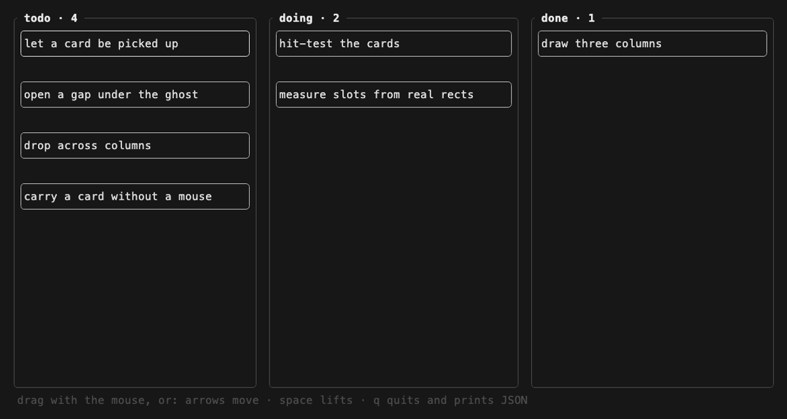

# ratatui-dnd

Drag and drop for [ratatui](https://ratatui.rs): attach sorting to lists
you already draw, with mouse or keyboard.



This crate does not own your list, your kanban, or your grid — you keep
drawing them however you do, with raw `Layout`, ratatui's own `List`, or
any widget that can say where its rows ended up. You register
those rectangles each frame, and in return you get lift, a ghost that
hangs from the grab point, the gap where a drop would land, and the drop
itself, already resolved to a container and a slot.

- **Layout-agnostic.** Slots are measured from the rectangles you
  actually drew, so vertical lists of any row heights, horizontal
  strips, and row-major grids all work from one rule, without being
  told which one they are.
- **Containers are first-class.** Drag between columns, and drop just
  past a border and still land in the nearest container.
- **Keyboard, too.** Everything a mouse drag does can be done without a
  mouse: lift, step the item through slots and across containers, drop,
  or let go.
- **Scrolled views fit.** A scrolled list can only register what is on
  screen; register that window and the index it starts at, and slots
  still come back in full-list terms.
- **Several at once.** The crate holds one handle; what a grab takes
  along is your model's business. Keep a selection, leave the whole
  selection out of what you register while one of it is held, and move
  all of it where the drop says — the kanban example does this with `x`.
- **Machine-friendly.** With the `serde` feature the resolved events
  serialize, and the kanban example reads a board as JSON and prints
  the sorted board back — a program can hand a pile of work to a human,
  let them arrange it, and read the result.

## How it fits your code

```rust
use ratatui_dnd::{Act, Sortable};

let mut sort: Sortable<&'static str, u64> = Sortable::new();

// While rendering, say where things actually are. While something is
// held, leave it out — it is in the hand, not in a list.
sort.container("todo", lane_area, &rows); // rows: &[(id, Rect)]

// Ask where the gap should open, and where the ghost rides.
if let Some((lane, slot)) = sort.over() { /* draw a hole at slot */ }
if let Some(g) = sort.ghost(frame.area()) { /* draw the held row at g */ }

// Feed events through; a drop comes back resolved.
match sort.on_mouse(mouse_event) {
    Act::Drop { key, container, slot } => { /* move it in your model */ }
    Act::Click(key) => { /* a press that never became a drag */ }
    _ => {}
}

// The keyboard does the same job step by step.
sort.lift(id);
sort.shift(1);            // next slot (use ±columns to walk a grid by rows)
sort.shift_container(1);  // next container
if let Some((key, container, slot)) = sort.put() { /* move it */ }
```

Everything that happens is also reported as data — the hook stream:

```rust
for hook in sort.hooks() {          // drain once a frame
    match hook {
        Hook::Grab { key, from } => {}                       // picked up
        Hook::Target { container, slot, .. } => {}           // the gap moved
        Hook::Drop { key, from, container, slot } => {}      // put down
        Hook::Cancel { key } => {}                           // let go
        Hook::Click { key } => {}                            // never dragged
    }
}
```

Mouse and keyboard feed the same stream, `Target` fires once per move
rather than once per event, and `from` says where the thing was picked
up — enough for an undo log, autosave, a sound, or syncing a peer.
With the `serde` feature, hooks serialize. The kanban example narrates
its stream in the status line.

Two layers, kept apart on purpose:

- `interact` — the ground floor: a drag state machine over raw mouse
  events (`Drag`), and a per-frame map from screen cells back to what
  was drawn on them (`Hits`). It knows nothing about sorting; scrubber
  heads, chart brushes, and resize handles sit on it just as well.
- `sort` — one tenant of that floor: containers, measured slots, the
  keyboard carry.

## Examples

```sh
cargo run --example kanban   # three lanes, multi-select with x; reads/prints the board as JSON
cargo run --example list     # ratatui's own List widget, made sortable
cargo run --example grid     # a row-major grid, same rule as a list
cargo run --example scroll   # a long list inside tui-scrollview, wheel and all
cargo run --example handrolled  # list.rs with the crate left out — read them side by side
```

`list.rs` and `handrolled.rs` are the same app, line for line, except
that one uses this crate and the other writes the drag out by hand.
The difference — a mouse state machine, hit testing, midline
arithmetic, a clamped ghost, and a second holding state for the
keyboard, ~170 lines for even this smallest case — is what the crate
is for.

Every example speaks both mouse (drag things) and keyboard (arrows move,
space lifts and drops, esc lets go).

Mouse events reach a terminal program only when capture is on:

```rust
crossterm::execute!(std::io::stdout(), crossterm::event::EnableMouseCapture)?;
```

## License

MIT or Apache-2.0, at your option.
